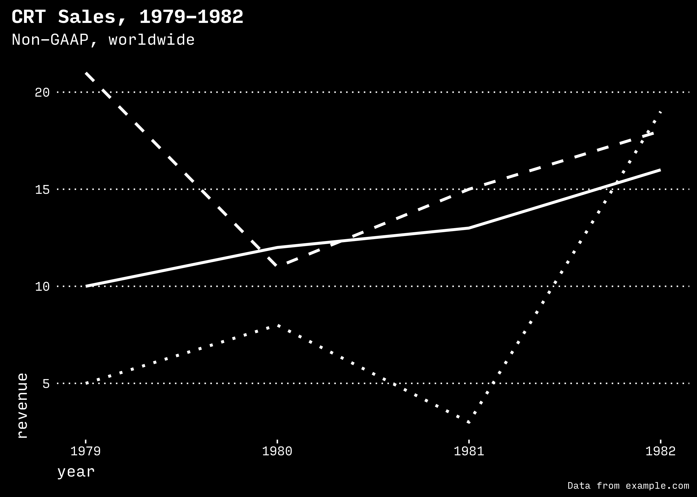
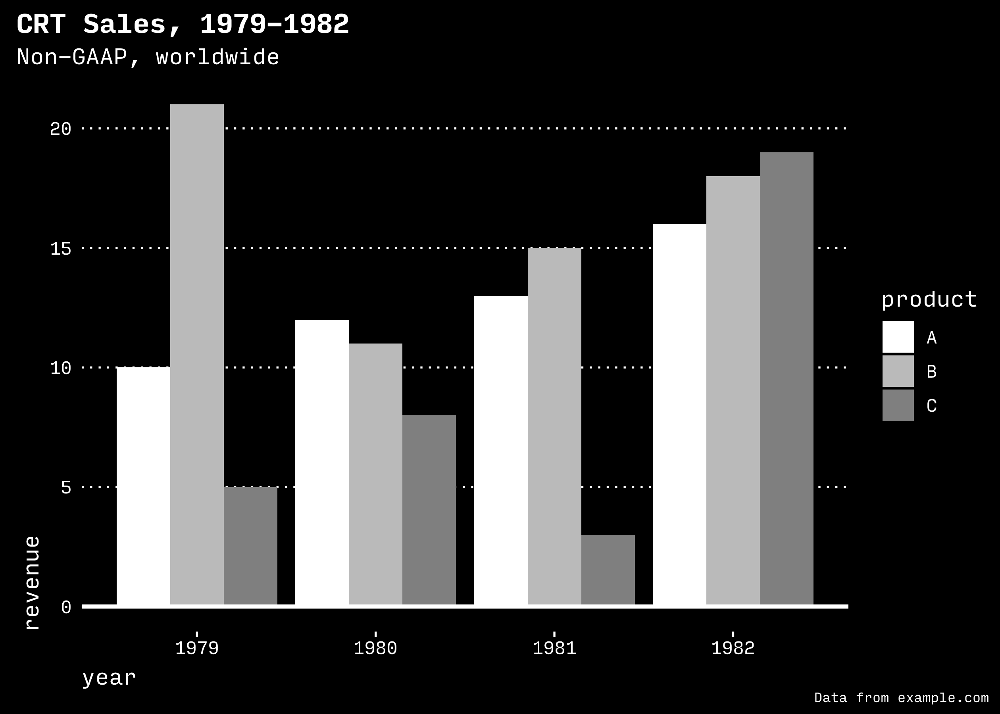

<!-- README.md is generated from README.Rmd. Please edit that file -->

# gghighcontrast

A high contrast retro theme with solid colors.

## Examples

## Installation

<!--

You can install gghighcontrast from CRAN with:


```r
install.packages("gghighcontrast")
```

-->

If you want the development version, you can install ggdark from GitHub
with:

``` r
# install.packages("devtools")
devtools::install_github("topfunky/gghighcontrast")
```

## High contrast mode for ggplot2

``` r
library(ggplot2)
library(gghighcontrast)

data <- data.frame(
  year = c(
    1979,
    1979,
    1980,
    1980,
    1981,
    1981,
    1982,
    1982,
    1979,
    1980,
    1981,
    1982
  ),
  product = c("A", "B", "A", "B", "A", "B", "A", "B", "C", "C", "C", "C"),
  revenue = c(10, 21, 12, 11, 13, 15, 16, 18, 5, 8, 3, 19)
)

plot_line_high_contrast <-
  function(data,
           foreground_color = "white",
           background_color = "black") {
    chart <-
      ggplot(data,
             aes(
               x = year,
               y = revenue,
               group = product,
               linetype = product
             )) +
      geom_line(color = foreground_color, size = 1) +
      theme_high_contrast(
        foreground_color = foreground_color,
        background_color = background_color,
        base_family = "InputMono"
      ) +
      theme(legend.position = "none") +
      scale_linetype_high_contrast() +
      labs(title = "CRT Sales, 1979-1982",
           subtitle = "Non-GAAP, worldwide",
           caption = "Data from example.com")
  }

p <- plot_line_high_contrast(data)
p
```

<!-- -->

``` r
library(ggplot2)
library(gghighcontrast)

data <- data.frame(
  year = c(
    1979,
    1979,
    1980,
    1980,
    1981,
    1981,
    1982,
    1982,
    1979,
    1980,
    1981,
    1982
  ),
  product = c("A", "B", "A", "B", "A", "B", "A", "B", "C", "C", "C", "C"),
  revenue = c(10, 21, 12, 11, 13, 15, 16, 18, 5, 8, 3, 19)
)

plot_bar_high_contrast <-
  function(data,
           foreground_color = "white",
           background_color = "black") {
    chart <- ggplot(data, aes(x = year, y = revenue, fill = product)) +
      geom_bar(stat = "identity", position = position_dodge()) +
      geom_hline(yintercept = 0,
                 color = foreground_color,
                 size = 1) +
      theme_high_contrast(
        base_family = "InputMono",
        foreground_color = foreground_color,
        background_color = background_color
      ) +
      scale_fill_high_contrast(foreground_color = foreground_color) +
      labs(title = "CRT Sales, 1979-1982",
           subtitle = "Non-GAAP, worldwide",
           caption = "Data from example.com")
  }
p <- plot_bar_high_contrast(data)
p
```

<!-- -->

## Usage

Download the [Input Mono font](https://input.fontbureau.com/) to achieve
the styles you see here.
